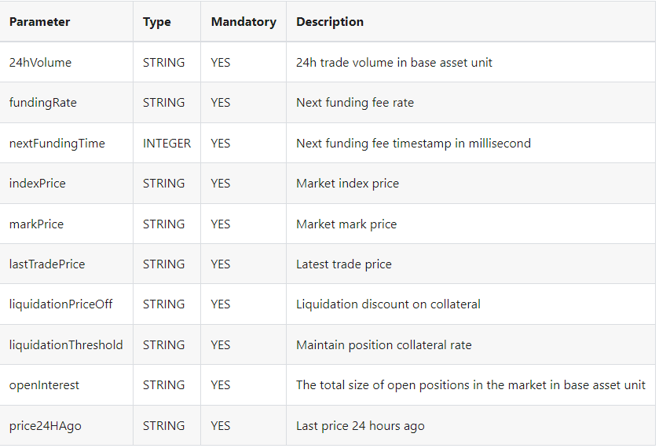
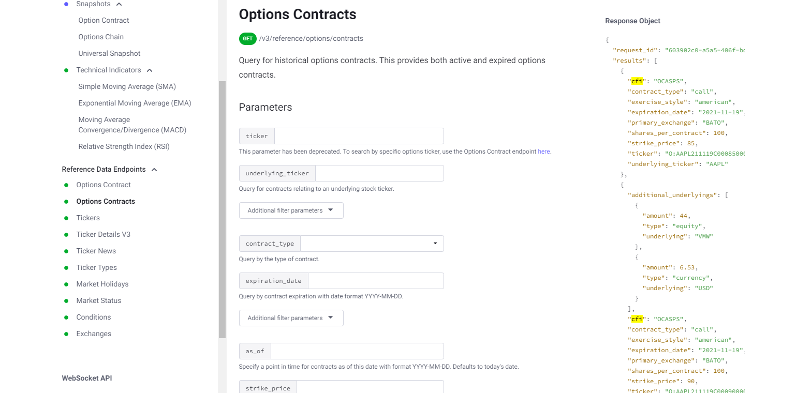

# Real Time Price Tracker

## 1- Clone the repository

### `git clone https://github.com/karim12345-gif/Real-time-Price-Tracker.git`

## 2- Install dependencies

### `yarn install`

## 3- Create an .env file

Create a .env file in the root directory of the project, later on i will tell you what keys to add for the websocket to work.

## 4- Running the App

To run the app locally, use the following command:

### `yarn start`

## 5- To Run Tests

You have to choice, since am using vitest for testing, you can use the Vitest UI or test from the terminal.

In the terminal (Ctrl + J), run the following:

### `yarn test` or  ` yarn run test:ui `

****

# Architecture and Library Choices

### 1- React

The project is built with React, a popular JavaScript library for building user interfaces. React's component-based architecture makes it easy to manage complex UIs.

### 2- Material-UI

Material-UI was used for styling and components. It provides a set of pre-designed components that follow the Material Design guidelines, making it easy to start with.

### 3- React Query

React Query is used for managing and caching server state. It provides hooks for fetching, caching, and updating data from server APIs in React applications.

### 4- React Router

React Router is used for client-side routing.

### 5- Vitest

I have decided to use vitest because it provides better support and integration for React testing compared to Jest, offering features like React Hooks testing utilities.
****

# API's

To be honest, selecting the API was a challenging task due to the requirement of finding a suitable free option. Initially, I explored APIs like GeckoApi, but encountered issues such as rate limiting ` (error 429) ` after implementation.

Eventually, I decided to use an API provided by Polygon.io and a WebSocket from a website called JOJO. The decision to use these services was influenced by their reliability, availability of required data, and ease of integration into the project. The most important thing was that their documentation was similar and easy to understand and begin working..

Here are the links to the documentation for reference:

` 1- https://docs.jojo.exchange/ `

` 2- https://polygon.io/docs/crypto/getting-started `

# 1- WebSocket Integration

## Overview

 In the code , there contains a custom React hook called ` useWebSocket `, designed to establish a WebSocket connection and handle incoming data from a specified URL.

## Features

#### 1- To make the connection , we will establishe a WebSocket connection with the url from the documentaion to fetch Market stream data

### figure shows the expected data available from the endpoint

#### 2- To subscribe to the market stream we have to enter the keys according to the specified API documentation

#### 3- We will handles incoming messages, including ping frames and market data updates

#### 4- Then we have to parses incoming JSON messages and updates the state with market data

#### 5- Finally handle the WebSocket connection closure and error events

## Configuration

Set the following environment variables in a .env file in the root directory of your project:

    #### 1- REACT_APP_WEBSOCKET_URL_LINK = wss://stream.base-mainnet.jojo.exchange/v1/multiple?streams=btcusdc@market
    #### 2- REACT_APP_WEBSOCKET_ID_KEY= 1
    #### 3- REACT_APP_WEBSOCKET_METHOD_KEY=SUBSCRIBE
    #### 4- REACT_APP_WEBSOCKET_PARAMS_KEY=btcusdc@market

 ****

# 2 - API Integration

## Overview

 This api is a Query for historical options contracts. This provides both active and expired options contracts.

## Features

#### 1- This api endpoint was simple and strightforward, there were queries but they are all optional. I used it without using the queries.

### figure shows the expected data available from the endpoint

#### 2- Once we have the api, we can create an interface that has the body response of that api, pass it in our react query hook to expect the response.

#### 3- After creating hook, which is the logic, we will simple use the ` useGetListOptionsContract ` hook to fetch data

****

# Testing 
## Overview

 The testing suite for this project includes unit tests to ensure the functionality and reliability of the codebase. 

## Unit Tests

I Unit tested custom hooks, which include ` useGetListOptionsContract ` for API requests and ` useBgColor ` for managing background colors, are included to validate their functionality and ensure they handle data fetching and state management correctly.

Also tested the buttons, which focus on ensuring that buttons within the application trigger the intended actions and interactions, such as navigation to specific pages or triggering certain functionality.

****
# Assumptions

## 1- Assumption about Environment Variables

 I assumed that sensitive API keys needed for fetching data are stored securely in a ` .env ` file, following best practices for environment configuration. This helps protect sensitive information and ensures that keys are not exposed in the codebase in a repo for example

## 2- Library Choice for API Fetching

I chose React Query for fetching data from the API, React Query is used for API fetching due to its simplified data fetching logic, reduced boilerplate code, and built-in caching and error handling mechanisms.

## 3- WebSocket Custom Hook

Since I've decided to stick to SOLID principles, I wanted to separate the logic and presentation/UI components. This represents challenges that arise from the need to pass data, which is where prop drilling comes in. And utilizing Redux for state management would be pointless and add complexity to the challenge, therefore the best solution I came up with was to design a custom hook.

By utilizing a custom hook to retrieve WebSocket data, I eliminated the need for prop drilling to send WebSocket-related props down the component tree. This decision contributes to a cleaner and more organized codebase, reducing unneeded clutter and avoiding potential prop drilling difficulties.
